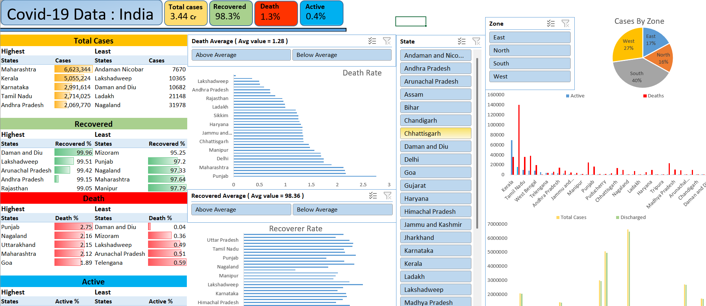
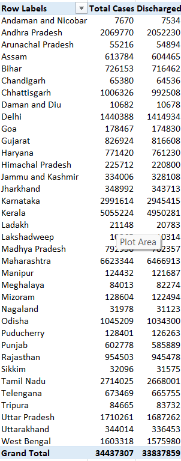

# COVID-19 India — Excel Data Analysis & Dashboard


## Project Overview

This project analyzes a state/UT-level COVID-19 dataset for India using Microsoft Excel. The workbook combines structured data, calculated ratios, state-level comparisons, zone-level aggregation, and a dashboard designed to communicate the main patterns quickly.

## Dashboard Preview



## Workbook Analysis Screenshots

### Death Ratio Analysis


### Discharge Ratio Analysis



### Total Cases vs Discharged


## Analytical Questions

- Which states/UTs recorded the highest total cases?
- Which states had the highest and lowest discharge ratios?
- Which states had the highest death ratios?
- Which states had the highest active-case ratios?
- How were recorded cases distributed across geographic zones?
- Do active, discharged, and death counts reconcile to total cases?

## Key KPIs

| Metric | Result |
|---|---:|
| States / UTs | 36 |
| Total recorded cases | 34,437,307 |
| Active cases | 135,918 |
| Discharged | 33,837,859 |
| Deaths | 463,530 |
| Weighted discharge ratio | 98.26% |
| Weighted death ratio | 1.35% |
| Weighted active ratio | 0.39% |

> These figures describe the supplied workbook snapshot. They are not current COVID-19 statistics.

## Key Findings

**Highest case volume:** Maharashtra — 6,623,344 cases.

**Highest discharge ratio:** Daman and Diu — 99.96%.

**Lowest discharge ratio:** Mizoram — 95.25%.

**Highest death ratio:** Punjab — 2.75%.

**Highest active ratio:** Mizoram — 4.39%.

**Highest zone case volume:** South — 13,650,538 cases.

## Zone Distribution

| Zone | Total Cases |
|---|---:|
| South | 13,650,538 |
| West | 9,386,876 |
| East | 5,884,786 |
| North | 5,515,107 |

## Data Validation

- 36 state/UT records
- 12 columns
- 0 duplicate state/UT records
- 0 missing cells in the populated source table
- Active + Discharged + Deaths = Total Cases
- Workbook ratios independently checked within normal two-decimal rounding tolerance

`135,918 + 33,837,859 + 463,530 = 34,437,307`

## Workbook Sheets

| Sheet | Purpose |
|---|---|
| Data | Source state/UT table and calculated ratios |
| DashBoard | Main dashboard |
| Cases and Recovered | State-wise case and discharge comparison |
| Active And Deaths | Active and death comparison |
| States and Zones | Zone-level summary |
| Recovered Index | Discharge-ratio analysis |
| Death Index | Death-ratio analysis |

## Repository Structure

```text
covid-19-india-excel-dashboard/
├── README.md
├── workbook/
│   ├── Covid Dashboard.xlsx
│   └── README.md
├── data/
│   └── covid_india_state_snapshot.csv
├── docs/
│   ├── DATA_DICTIONARY.md
│   ├── FINDINGS.md
│   ├── METHODOLOGY.md
│   └── QUALITY_AUDIT.md
└── screenshots/
    ├── 01-dashboard.png
    ├── 02-death-analysis.png
    ├── 03-discharge-analysis.png
    └── 04-cases-recovered.png
```

## Skills Demonstrated

- Microsoft Excel
- Data cleaning and validation
- KPI calculation
- Ratio analysis
- Ranking and comparison
- Pivot-style analysis
- Dashboard development
- Data visualization
- Analytical storytelling

## Important Caveats

The supplied `Data` sheet has no date field and the workbook does not document an original source URL. Therefore this project should not be presented as current COVID-19 data or as a time-series analysis.

The supplied dataset also contains historical naming such as `Daman and Diu` and the spelling `Telengana`. These are documented as source-data characteristics rather than silently changed.

## Recruiter Summary

This project demonstrates an end-to-end Excel analytics workflow: **Data → Validation → Calculation → Comparison → Regional Aggregation → Dashboard → Insights**.

## Author

**Golam Shakir** — Aspiring Data Analyst | SQL, Excel & Power BI

[GitHub Profile](https://github.com/gshakir-ops)
